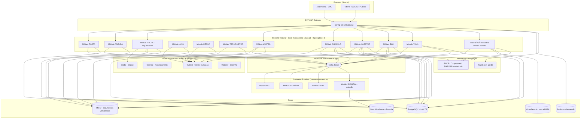
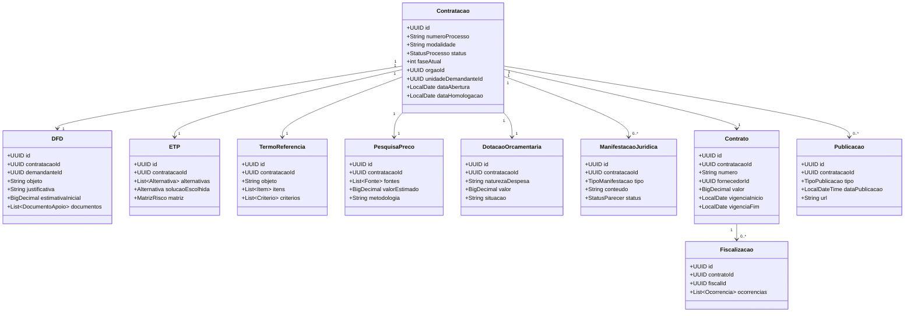

# Proposta Técnica de Engenharia — Plataforma ÓRBITA

**Setor de Planejamento e Acompanhamento de Contratações — SPAC**
**Versão:** 1.0
**Status:** Proposta para apreciação

---

## 0. Como ler este documento

Esta proposta assume que o leitor (gestão do SPAC, equipe técnica, área jurídica) entende o domínio da contratação pública e o conceito dos 19 módulos descritos no documento de apresentação. As decisões aqui são **deliberadas**, não enumeração de opções — quando há mais de uma alternativa viável, eu digo qual recomendo e por quê, depois mostro as outras como contraponto.

> **Princípio-mestre:** *"A Trilha orquestra, mas o processo é um só."* Toda decisão de arquitetura começa daqui.

---

## 1. Resumo Executivo

A ÓRBITA é, no fundo, **um sistema de ciclo de vida de processo** (a contratação) com **duas vias transversais** (fornecedores / publicações) e **oito serviços de suporte** (gestão, alertas, indicadores, etc.). Isso muda tudo. Não é 19 sistemas. É 1 processo + serviços especializados.

Recomendação central:

| Decisão | Recomendação |
|---|---|
| **Estilo arquitetural** | **Monolito Modular** (DDD com bounded contexts), com **Trilha sobre um motor de workflow BPMN** (Camunda 8) e **event-driven interno via Kafka** para módulos que são naturalmente reativos (Memória, Farol, Eco, Bússola). |
| **Evolução para microsserviços** | Planejada e seletiva, **a partir de F3**, quando Vitrine, Ímã e Bússola podem ser extraídos como serviços autônomos por terem perfis de escala/segurança diferentes. |
| **Linguagem principal** | **Java 21 + Spring Boot 3** (consistência, maturidade, ecossistema governamental). |
| **Frontend** | **Next.js 14 (React 18)** com camadas: app interna (SPA) + portal público Vitrine (SSR/ISR). |
| **Banco de dados** | **PostgreSQL 16** (OLTP) + **OpenSearch** (busca/Mapa) + **MinIO** (documentos) + **Redis** (cache/sessão). |
| **Mensageria** | **Apache Kafka** (eventos de domínio, evento-sourcing parcial para Memória). |
| **Orquestração de fluxo** | **Camunda 8** (Zeebe + Operate + Tasklist) — não construir o que a Trilha descreve. |
| **Identidade** | **Keycloak** com integração gov.br (OIDC) e certificado e-CPF/A1/A3. |
| **Infraestrutura** | **Kubernetes** (on-prem ou cloud soberana), GitLab CI, ArgoCD. |

A escolha de **monolito modular** é deliberada e tem a ver com a natureza do domínio. Justifico em detalhe na Seção 2.

---

## 2. Padrão Arquitetural Recomendado

### 2.1. A pergunta real não é "qual padrão" — é "qual é o agregado"

Para escolher bem, é preciso olhar o domínio, não a buzzword. A pergunta certa é:

> *Os 19 módulos compartilham um mesmo agregado de domínio (a contratação) e uma mesma verdade transacional, ou são domínios independentes que conversam entre si?*

A resposta sai direto da documentação:

- A **contratação** é **um único objeto** que nasce na PORTA, é planejado na AGENDA, é instruído pela TRILHA, recebe dotação no LASTRO, é analisada pelo ORÁCULO, conduzida pelo MAESTRO, executada no ELO/VIGIA, e publicada pelo ECO. Em todas as etapas, é o **mesmo processo** com **um identificador** e **uma trilha de auditoria contínua**.
- A TRILHA **orquestra** — ou seja, o estado do processo precisa estar acessível de forma síncrona e consistente para decidir a próxima etapa. Isso é fluxo transacional, não coreografia assíncrona.
- O ÍMÃ (fornecedores) é transversal, mas é um **contexto separado** (cadastro de fornecedores ≠ processo de contratação). Ele **serve** a contratação, não a contém.
- MEMÓRIA e FAROL são **reativos por natureza** — eles consomem eventos do domínio.

Isso elimina duas opções e indica uma:

- ❌ **Microsserviços desde o dia 1:** o custo operacional (19 deploys, rede, observabilidade distribuída, transações distribuídas) é desproporcional ao ganho, e o domínio não é rico o suficiente para justificar domínios independentes. Em particular, o problema clássico de "transação distribuída" aparece *exatamente* no fluxo principal (PORTA→TRILHA→LASTRO→ORÁCULO→MAESTRO→ELO), onde **não se pode perder consistência**.
- ❌ **Monolito puro (sem modularização):** mata a evolução e a autonomia da equipe. 19 módulos em um único pacote sem fronteiras = dívida técnica em 12 meses.
- ✅ **Monolito Modular + Event-Driven interno + Workflow Engine para Trilha:** mantém o agregado coeso, dá fronteiras claras (bounded contexts do DDD), aproveita o reativo onde faz sentido, e ainda permite extrair serviços depois.

### 2.2. A Trilha é um motor de workflow — use um

A TRILHA, como descrita no documento, é literalmente um motor de BPMN:

- Identifica etapas necessárias
- Controla dependências e pré-requisitos
- Distribui responsabilidades
- Decide quando o processo pode avançar
- Permite retorno para correção
- Não segue necessariamente um percurso linear

**Construir isso do zero é o erro mais comum (e mais caro) em sistemas desse tipo.** A recomendação é adotar o **Camunda 8** (Zeebe como core, Operate para monitoramento, Tasklist para trabalho humano, Modeler para desenho BPMN). Razões:

1. **BPMN 2.0 é o padrão da indústria** para fluxos como o da Lei 14.133. O fluxo de contratação tem variantes (pregão, concorrência, concurso, diálogo competitivo, dispensa, inexigibilidade) e a modelagem visual em BPMN é a melhor forma de manter a complexidade sob controle.
2. **Versionamento de fluxo:** alterações regulatórias (e a Lei 14.133 ainda está em fase de consolidação jurisprudencial) exigem mudar regras sem perder processos em curso. Camunda já resolve isso.
3. **Auditoria nativa:** Camunda registra toda transição de estado com timestamp, ator, variáveis. Casa diretamente com a MEMÓRIA.
4. **Integração com humanas e automações:** o Tasklist do Camunda é a UI para o usuário trabalhar nas tarefas (a "Lupa" do ETP, a "Régua" do TR, etc.). Evita reinventar fila de tarefas humanas.
5. **Ecossistema:** conectores para Kafka, email, RabbitMQ, REST, etc. Mantém os módulos da ÓRBITA plugáveis.

> **A integração com a Lei 14.133 é o ponto-chave aqui.** Um motor BPMN torna viável representar variantes de modalidade (pregão eletrônico, pregão presencial, concorrência, diálogo competitivo, dispensa, inexigibilidade) como subprocessos com gateways e regras de elegibilidade. Fazer isso em código de aplicação é meses de trabalho a mais e manutenção contínua.

### 2.3. Memória = event log (não banco de auditoria à parte)

O módulo MEMÓRIA é descrito como "preservar a história dos processos e das atividades". A forma ingênua é ter uma tabela `audit_log` à parte e escrever nela em cada operação. Problema: gera acoplamento, tem o problema do "duplo write" (escrevi no banco mas o log falhou?).

A recomendação é **event sourcing parcial** para o agregado `Contratação`:

- Cada mudança de estado do processo é um **evento imutável** (ex.: `DemandaRecebida`, `DFDFormalizado`, `ETPIniciado`, `ETPConcluido`, `TREncaminhadoParaAnaliseJuridica`, `ParecerEmitido`, ...).
- O estado atual do processo é uma **projeção** dos eventos.
- A **MEMÓRIA** é literalmente o **log de eventos** — uma materialized view de fácil consulta, com indexação por processo, ator, período.
- A **BUSÍSSOLA** (indicadores) também é uma projeção dos mesmos eventos — materializada em um data mart separado (Bússola pode ser read-only do log, em batch ou via Kafka Streams).

Vantagens:
- A história nunca se perde (append-only).
- Reconstrução determinística: dado o log, recupero qualquer estado passado.
- Auditoria por construção, não por convenção.
- Permite a MEMÓRIA ser tanto módulo da ÓRBITA quanto exportável (LGPD-friendly — dado pessoal pode ser anonimizado na projeção sem mexer no evento bruto).

> **LGPD é ponto de atenção aqui:** eventos contêm dados pessoais (CPF/CNPJ de demandantes, fiscais, gestores). A solução é (a) pseudonimização na materialização da MEMÓRIA, (b) retenção diferenciada, (c) base legal explícita em cada tipo de evento.

### 2.4. Onde event-driven interno faz sentido

Event-driven **não é a topologia de deploy**, é um **padrão de comunicação** entre partes do mesmo sistema. Dentro do monolito modular, alguns bounded contexts se beneficiam de reagir a eventos em vez de chamar APIs síncronas:

| Módulo | Estilo | Razão |
|---|---|---|
| TRILHA → LUPA, RÉGUA, TERMÔMETRO | **Síncrono** (chamada de serviço) | Trilha decide próxima etapa, precisa de resposta imediata sobre pré-requisitos. |
| ORÁCULO ← TRILHA | **Síncrono** (subprocesso BPMN) | Trilha "aciona" o Oráculo como subprocesso de análise. |
| MAESTRO ← ÍMÃ | **Síncrono** (consulta) | Maestro consulta dados do fornecedor; é leitura. |
| ECO ← (qualquer módulo) | **Assíncrono** (evento) | Publicação é uma reação a "algo foi homologado", "contrato assinado", etc. Eco é um **listener**. |
| MEMÓRIA ← (tudo) | **Assíncrono** (evento) | Append-only, sem necessidade de resposta. |
| FAROL ← (tudo) | **Assíncrono** (evento) | Calcula prazos a partir de eventos. |
| BÚSSOLA ← (tudo) | **Assíncrono** (read model) | Projeção estatística; não pode atrapalhar o fluxo. |
| VITRINE ← ECO | **Assíncrono** (evento) | Portal público consome publicação confirmada. |

Resultado: Kafka como backbone de eventos entre o **core transacional** (síncrono) e os **contextos reativos** (assíncrono). Isso é o que o livro "Building Evolutionary Architectures" chama de **arquitetura evolutiva**: começa simples (monolito), mas as fronteiras são explícitas, então evoluir é decompor, não reescrever.

### 2.5. Quando extrair microsserviços

A extração é planejada para **Fase 3+**, com critérios objetivos:

| Serviço candidato | Critério de extração |
|---|---|
| **VITRINE** (portal público) | Crescimento de tráfego independente; separação de superfície de ataque (LGPD, dados públicos vs. internos); necessidade de SSR/edge cache. |
| **ÍMÃ** (fornecedores) | Integrações externas dominam a complexidade (PNCP, Comprasnet, APIs de certidões, sistemas estaduais). Time dedicado a lidar com instabilidade de terceiros. |
| **BÚSSOLA** (analytics) | Volume de leitura analítica não pode competir com carga transacional. Modelo de dados próprio (dimensional). |
| **OFICINA** (templates) | Pode ser reutilizada por outros sistemas do órgão. |
| **TERMOFLUXO externo** (preços) | Integração com fontes de preço (Painel de Preços, Comprasnet) justifica isolamento. |

O monolito **não é o ponto de chegada, é o ponto de partida certo**. A recomendação é **começar monolito, extrair com critério**, não o contrário.

### 2.6. Diagrama lógico (alto nível)



---

## 3. Stack Tecnológica

### 3.1. Critérios de escolha

Toda escolha de stack passou por quatro filtros:

1. **Maturidade operacional** (não adotar beta em sistema crítico de governo).
2. **Adequação ao ecossistema público brasileiro** (integração com gov.br, Comprasnet, PNCP, SIAFI, e-Gov).
3. **Capacidade da equipe** (SPAC vai operar e evoluir o sistema — a stack precisa de mão de obra encontrável no mercado).
4. **Custo total de propriedade** (open source first; cloud soberana quando aplicável).

### 3.2. Backend

**Recomendação: Java 21 + Spring Boot 3 + Spring Modulith.**

| Item | Recomendação | Por quê |
|---|---|---|
| Linguagem | **Java 21 (LTS)** | LTS, records, pattern matching, virtual threads maduros. Stack dominante no setor público brasileiro. |
| Framework | **Spring Boot 3.3+** | Ecossistema maduro (Web, Data, Security, Cloud, Batch, Integration, AI). |
| Modularização | **Spring Modulith** | Framework oficial do Spring para **bounded contexts verificados em tempo de build** (ArchUnit). Garante que as fronteiras de módulo se mantenham. |
| Workflow | **Camunda 8 (Zeebe)** | Já justificado. Open source (free tier community). |
| ORM | **Spring Data JPA + Hibernate 6** | Maduro, mas usado com critério (consultas complexas em `Querydsl` ou SQL nativo). |
| Migrações | **Flyway** | Versionamento de schema obrigatório. |
| Validação | **Bean Validation (Jakarta Validation)** | Padrão. |
| Documentação API | **SpringDoc OpenAPI** | Swagger gerado, importante para integrações. |
| Cliente HTTP | **Spring WebClient / Feign** | Para integrações externas (PNCP, Comprasnet). |
| Testes | **JUnit 5 + Mockito + Testcontainers + ArchUnit** | Testcontainers sobe Postgres/Kafka/Camunda/Zeebe em Docker no teste de integração. |

> **Por que não Python (Django/FastAPI)?** Para um sistema desse porte, com alta criticidade transacional, time de sustentação gov e a obrigatoriedade de auditoria fina, Java com Spring é a escolha de menor risco. Python é válido para módulos analíticos (Bússola, eventualmente) ou IA, mas não para o core.

> **Por que não .NET?** Viável e tem presença em gov (Receita Federal usa). Mas o ecossistema de portais, integrações com gov.br e BPMN é mais natural em Java. Se a equipe já é .NET, é defensável — eu avalio caso a caso.

### 3.3. Frontend

**Recomendação: Next.js 14 (React 18) + TypeScript.**

| Item | Recomendação | Por quê |
|---|---|---|
| Framework | **Next.js 14 (App Router)** | SSR/ISR para o portal público Vitrine; SPA para app interna. Type safety ponta a ponta. |
| Linguagem | **TypeScript 5** | Não-discutível em sistema de governo. |
| UI | **Design system próprio** baseado em **Radix UI + Tailwind** | Acessibilidade (e-MAG / WCAG 2.1 AA obrigatório em portal público) sem reinventar. |
| State | **TanStack Query** (server state) + **Zustand** (UI state) | Simples, suficiente. |
| Formulários | **React Hook Form + Zod** | Validação tipada, performance. |
| Tabelas complexas | **TanStack Table** | Para Águia/Mapa/Bússola (listas grandes com filtros). |
| Editor de documentos | **TipTap** (ProseMirror) ou integração nativa com **LibreOffice / OnlyOffice** | Para o editor de DFD/ETP/TR no Tasklist do Camunda ou dentro dos módulos LUPA/RÉGUA. |
| Assinatura digital | Integração **e-CPF A1/A3** via **web extension** ou **gov.br ID** | Para DFD, ETP, TR, contrato assinado. |
| Testes | **Vitest + Testing Library + Playwright** (E2E) | Playwright para fluxos críticos. |
| Acessibilidade | **axe-core** em CI | Bloquear regressões de a11y. |

### 3.4. Banco de Dados

**Recomendação: PostgreSQL 16 como banco principal + OpenSearch para busca + Redis para cache.**

| Item | Recomendação | Por quê |
|---|---|---|
| OLTP | **PostgreSQL 16** | Maduro, ACID forte, JSONB para dados semi-estruturados, partição nativa, row-level security. |
| Schema por bounded context | **1 schema por módulo** (ex: `contratacao`, `fornecedor`, `workflow`, `auditoria`) | Isolamento lógico dentro do mesmo banco físico. |
| Documentos | **PostgreSQL** para metadados + **MinIO (S3)** para o binário | Binário não vai no banco. |
| Versionamento de docs | **Append-only table** com `versao` + `documento_id` + hash de conteúdo | Justifico em detalhe na Seção 4. |
| Busca textual | **OpenSearch** | Para o MAPA (busca por qualquer campo) e VITRINE (busca pública). Sincronizado via Debezium do Postgres (CDC) ou via eventos Kafka. |
| Cache | **Redis 7** | Cache de consulta do ÍMÃ, sessões, rate limiting. |
| Analytics | **ClickHouse** ou **PostgreSQL com materialized views** para BÚSSOLA | Bússola pode começar com materialized views; ClickHouse se o volume justificar. |
| Auditoria | **Append-only table no Postgres + Kafka log** (event sourcing) | Redundância proposital — Kafka é a verdade de eventos, Postgres é a projeção. |

### 3.5. Mensageria

**Recomendação: Apache Kafka.**

| Item | Recomendação | Por quê |
|---|---|---|
| Broker | **Apache Kafka 3.6+ (KRaft mode, sem Zookeeper)** | Maduro, alta vazão, retenção longa (semanas) é importante para replay/reprocessamento. |
| Schema registry | **Confluent Schema Registry** (ou Apicurio, se preferir open source puro) | Versionamento de schema de eventos — obrigatório. |
| Producer/consumer | **Spring for Apache Kafka** | Integração nativa com Spring Boot. |
| Tópicos por evento de domínio | `contratacao.events.v1`, `fornecedor.events.v1`, `publicacao.events.v1`, `auditoria.events.v1` | Granularidade por agregado, versionados. |
| Outbox pattern | **Spring Modulith Outbox** ou **Debezium** | Garante consistência entre Postgres e Kafka sem dual-write. |

> **Por que não RabbitMQ?** RabbitMQ é ótimo para tarefas (filas curtas, ack/nack), mas a MEMÓRIA e a BÚSSOLA precisam de **retensão longa** e **replay** — Kafka é o modelo certo. Para tarefas, uso interno do Camunda (Zeebe tem seu próprio log).

### 3.6. Identidade, Segurança e Assinatura

| Item | Recomendação | Por quê |
|---|---|---|
| Identidade | **Keycloak 24+** com OIDC e SAML | Padrão open source, suporte a gov.br via OIDC, federation. |
| MFA | Gov.br ID nativo (ouro/prata) | Não reinventar. |
| Assinatura digital | **e-CPF A1/A3 via biblioteca PKI** + **gov.br Assinatura Eletrônica** (quando suficiente) | Casa com a legislação brasileira. |
| Cofre de segredos | **HashiCorp Vault** ou **AWS Secrets Manager / Azure Key Vault** (dependendo do deploy) | Certificados A1 e credenciais de APIs externas. |
| LGPD | **Pseudonimização na materialização da MEMÓRIA**; RLS no Postgres; logs de acesso; DPO tooling | Obrigatório. |
| SIEM | Integração com **Wazuh** ou SIEM do órgão | Trilha de auditoria vai para o SIEM do órgão. |

### 3.7. Infraestrutura e DevOps

| Item | Recomendação | Por quê |
|---|---|---|
| Orquestração | **Kubernetes 1.30+** (EKS / GKE / AKS / on-prem) | Padrão. Em gov, frequentemente **on-prem** ou **cloud soberana** — a recomendação é manter a stack Kubernetes-portável. |
| Service mesh | **Istio** ou **Linkerd** (apenas se extrair microsserviços em F3+) | Adiar até ter razão para adotar. |
| CI | **GitLab CI** ou **GitHub Actions** | Avaliar com a equipe. GitLab é comum em gov. |
| CD | **ArgoCD** (GitOps) | Declarativo, auditável. |
| Registry | **Harbor** (privado) ou GitLab Container Registry | Política de imagens. |
| Observabilidade | **Prometheus + Grafana + Loki + Tempo** (ou **Datadog/New Relic** se aprovado) | Métricas, logs, traces. |
| IaC | **Terraform** + **Helm** (ou **Kustomize**) | Padrão. |
| Backup | **Velero** para K8s + **pgBackRest** para Postgres | RPO/RTO definidos no plano de continuidade. |
| Qualidade de código | **SonarQube** + **SpotBugs/PMD** + **ArchUnit** (no build) | Gates de qualidade. |
| SAST/DAST | **Trivy** + **OWASP ZAP** | Segurança em CI. |

### 3.8. Integrações externas

| Sistema | Como integrar |
|---|---|
| **gov.br (identidade e assinatura)** | OIDC + OAuth 2.0 + APIs gov.br. |
| **PNCP (Portal Nacional de Contratações Públicas)** | APIs REST do PNCP — **obrigatório pela Lei 14.133/2021**. Cliente HTTP com cache + reconciliação periódica. |
| **Comprasnet** | APIs SOAP/legacy — adapter dedicado. |
| **SIAFI / SIAFE (orçamento)** | Integração por API ou arquivo (varia por ente federativo). Adaptador. |
| **Painel de Preços** | API para TERMÔMETRO. |
| **Sistemas estaduais/municipais de fornecedores** | APIs próprias. **ÍMÃ** é o ponto único de integração, com adapters plugáveis. |
| ** Diário Oficial** | APIs de publicação (DOU, DOE). **ECO** é o publicador. |

---

## 4. Modelagem e Integração de Dados

### 4.1. O agregado raiz: `Contratação`

O conceito que costura todos os módulos é o **processo de contratação**. Tudo gira em torno dele. Recomendo modelar como agregado DDD com um `processo_id` (UUID) que é a chave de correlação em todos os módulos.



A regra de ouro: **um módulo nunca persiste o agregado de outro módulo**. Cada módulo tem seu próprio schema e é dono dos seus dados. A integração entre módulos é por **evento** (assíncrono) ou **chamada de serviço** (síncrona, via API interna do monolito), nunca por acesso direto a tabela de outro.

### 4.2. Schema por bounded context

```
postgres
├── schema: contratacao          (PORTA, AGENDA, TRILHA orquestração)
│   ├── contratacao
│   ├── dfd
│   ├── etp
│   ├── termo_referencia
│   ├── pesquisa_preco
│   ├── dotacao
│   ├── manifestacao_juridica
│   └── historico_eventos        (read-model da MEMÓRIA)
│
├── schema: licitacao            (MAESTRO)
│   ├── procedimento
│   ├── participante
│   ├── proposta
│   ├── julgamento
│   ├── recurso
│   └── adjudicacao
│
├── schema: contrato             (ELO, VIGIA)
│   ├── contrato
│   ├── fiscal
│   ├── ocorrencia
│   └── pagamento
│
├── schema: fornecedor           (ÍMÃ)
│   ├── fornecedor
│   ├── documento_habilitacao
│   ├── certidao
│   └── historico_relacionamento
│
├── schema: publicacao           (ECO)
│   ├── publicacao
│   └── destino_publicacao
│
├── schema: catalogo             (OFICINA, ATLAS)
│   ├── modelo_documento
│   ├── versao_modelo
│   ├── legislacao
│   └── knowledge_article
│
├── schema: identidade           (KEYCLOAK e metadados)
│
└── schema: auditoria            (eventos puros - replicado do Kafka)
    └── evento_dominio
```

### 4.3. Versionamento de documentos (OFICINA + MEMÓRIA)

O versionamento é um requisito explícito tanto da OFICINA (modelos padronizados com controle de versão) quanto da MEMÓRIA (rastreabilidade). Recomendo:

**Tabela `documento_versao` (OFICINA) — para modelos:**

```sql
CREATE TABLE catalogo.modelo_documento (
  id UUID PRIMARY KEY,
  tipo VARCHAR(50) NOT NULL,         -- 'DFD', 'ETP', 'TR', 'EDITAL', 'CONTRATO'
  nome VARCHAR(255) NOT NULL,
  created_at TIMESTAMPTZ NOT NULL,
  ativo BOOLEAN NOT NULL DEFAULT false
);

CREATE TABLE catalogo.versao_modelo (
  id UUID PRIMARY KEY,
  modelo_id UUID REFERENCES catalogo.modelo_documento(id),
  numero_versao INT NOT NULL,
  hash_conteudo VARCHAR(64) NOT NULL,    -- SHA-256
  storage_key VARCHAR(500) NOT NULL,     -- chave no MinIO
  metadata JSONB NOT NULL,                -- variáveis, instruções
  vigente_desde TIMESTAMPTZ,
  vigente_ate TIMESTAMPTZ,
  created_by UUID NOT NULL,
  created_at TIMESTAMPTZ NOT NULL,
  UNIQUE(modelo_id, numero_versao)
);
```

**Tabela `documento_instancia` (MEMÓRIA) — para documentos preenchidos:**

```sql
CREATE TABLE contratacao.documento_instancia (
  id UUID PRIMARY KEY,
  contratacao_id UUID NOT NULL,
  tipo VARCHAR(50) NOT NULL,             -- 'DFD', 'ETP', 'TR'...
  modelo_versao_id UUID,                 -- qual versão de modelo foi usada
  hash_conteudo VARCHAR(64) NOT NULL,
  storage_key VARCHAR(500) NOT NULL,
  preenchido_por UUID NOT NULL,
  preenchido_em TIMESTAMPTZ NOT NULL,
  status VARCHAR(30) NOT NULL,           -- 'rascunho', 'submetido', 'aprovado', 'substituido'
  substituido_por UUID                   -- aponta para a próxima versão
);

CREATE INDEX idx_doc_instancia_contratacao ON contratacao.documento_instancia(contratacao_id);
```

**Regras:**

1. **Storage é content-addressable:** o nome do objeto no MinIO é o `hash_conteudo` (SHA-256). Mesmo conteúdo = mesmo endereço = deduplicação natural.
2. **Append-only:** `documento_instancia` nunca é UPDATE. Para "editar", cria nova versão com referência à anterior via `substituido_por`.
3. **Modelo vigente vs instâncias existentes:** a OFICINA pode publicar uma nova versão do modelo, mas as instâncias já criadas permanecem com a versão original (não são regravadas). Isso preserva a integridade histórica.
4. **Assinatura digital:** para DFD/ETP/TR/contrato assinado, a assinatura do e-CPF ou gov.br embute o hash do documento — o ato de assinar **congela** a versão.
5. **Recuperação:** toda instância pode ser recuperada integralmente via `(contratacao_id, tipo, versão)`.

### 4.4. Transversalidade do ÍMÃ

O ÍMÃ é acessado por TERMÔMETRO, MAESTRO, ELO, VIGIA. Recomendo:

- **API síncrona interna** (REST/gRPC) para consultas em tempo real (ex.: "quais certidões deste fornecedor estão vencendo?").
- **Eventos assíncronos** para mudanças cadastrais que afetam contratos em curso (ex.: fornecedor foi sancionado → MAESTRO e ELO precisam saber).
- **Cache com TTL** agressivo para dados de habilitação (certidões mudam raramente).
- **Adaptadores plugáveis** por fonte externa (um adapter por API: PNCP, Comprasnet, Receita, etc.).
- **Histórico de relacionamento:** cada contrato, cada proposta, cada ocorrência de fiscalização vira um registro no histórico do fornecedor (consultável via BÚSSOLA).

### 4.5. Integração com sistemas externos (PNCP, Comprasnet, SIAFI)

| Sistema | Padrão | Resiliência |
|---|---|---|
| PNCP | REST síncrono + webhook (quando disponível) | **Outbox + retry com backoff exponencial**. Evento de "publicação confirmada" só é emitido após 200 OK do PNCP. |
| Comprasnet | SOAP legacy | **Adapter dedicado** com circuit breaker (Resilience4j). Cache local. |
| SIAFI | Variável por ente (API ou arquivo) | Adapter por ente. Processamento batch noturno. |
| Diário Oficial | APIs estaduais/UNIÃO | Adapter por veículo. |

**Padrão de resiliência universal:** circuit breaker, retry com backoff, fallback para fila de reprocessamento manual (a ÁGUIA mostra essas pendências).

### 4.6. LGPD e governança de dados pessoais

- **Identificação do tratamento:** mapa de dados pessoais por módulo (quem é o controlador, operador, base legal).
- **Pseudonimização na MEMÓRIA:** ao materializar a view de histórico, dados pessoais viram identificadores opacos; o dado bruto fica em vault com acesso restrito.
- **Direitos do titular:** endpoints para exportação e eliminação (dentro do que a legislação de transparência pública permite — contratar é dado público por definição, mas dados de fiscais internos podem ter tratamento específico).
- **Logs de acesso:** toda leitura de dado pessoal gera evento de auditoria.
- **Retenção:** política clara por tipo de documento (PNCP exige publicação por anos; contratos por 5+ anos conforme legislação).

---

## 5. Roadmap de Desenvolvimento

### 5.1. Princípios de phasing

1. **Cada fase entrega valor visível**, não só blocos técnicos.
2. **A primeira contratação completa de ponta a ponta** (DFD → contrato → fiscalização → publicação) é o **MVP de F1**, mesmo que com integrações parciais e UX espartana.
3. **Transversais (ECO, VITRINE, MEMÓRIA, FAROL) entram desde cedo**, mesmo que com escopo mínimo, para evitar refactor.
4. **Camunda entra na F0.** Não dá pra "depois adicionar workflow" — a modelagem do fluxo define a forma do sistema.
5. **A Vitrine só sai em F2**, mas a infraestrutura de publicação (ECO) é montada em F1.
6. **Módulos de inteligência (BÚSSOLA, ÁGUIA)** entram no fim — eles dependem de dados acumulados.

### 5.2. F0 — Fundação (3-4 meses)

**Objetivo:** base técnica, identidade, modelagem inicial, um fluxo de trabalho real (mesmo que simples) funcionando.

| Item | Detalhe |
|---|---|
| Infra | K8s cluster, GitLab CI, ArgoCD, Harbor, Prometheus+Grafana, Vault. |
| Banco | Postgres 16 + Flyway, schema inicial. |
| Mensageria | Kafka KRaft + Schema Registry. |
| Identidade | Keycloak com integração gov.br. |
| Motor de workflow | Camunda 8 (Zeebe, Operate, Tasklist, Modeler) instalado e modelando 1 fluxo real simples (DFD → Aprovação → Conclusão). |
| Design system | Figma + biblioteca Next.js base. |
| App shell | Next.js com layout, autenticação, navegação, layout base. |
| OFICINA | Catálogo de modelos (CRUD de modelos e versões). |
| MEMÓRIA | Append-only log + endpoint de consulta por processo. |
| Por que importa | Sem isso, nenhuma fase seguinte é viável com qualidade. |

**Entregável:** ambiente de homologação rodando, 1 fluxo de DFD ponta-a-ponta no Camunda, com persistência em Postgres, evento publicado no Kafka, MEMÓRIA recebendo, FAROL gerando 1 alerta dummy.

### 5.3. F1 — MVP funcional (5-7 meses após F0)

**Objetivo:** primeiro processo de contratação real (simplificado) fluindo de PORTA até MAESTRO, com auditoria e alertas.

| Módulo | Escopo mínimo |
|---|---|
| **PORTA** | Formulário de DFD, anexos, demandante, objeto, justificativa, quantidade, valor estimado. Workflow "DFD → Aprovação chefia → Encaminhamento para AGENDA". |
| **AGENDA** | Visualização do PAC, relacionar DFD a item do PAC, registrar necessidade superveniente com justificativa. |
| **TRILHA** | Orquestração em Camunda: identifica etapas obrigatórias (ETP, TR, preço, dotação), distribui tarefas via Tasklist, controla pré-requisitos, permite retorno para correção. |
| **LUPA** | Editor de ETP (TipTap + template da OFICINA), alternativas, matriz de risco básica. |
| **RÉGUA** | Editor de TR, itens, critérios, condições de execução. |
| **TERMÔMETRO** | Pesquisa de preços manual + integração com Painel de Preços. Cálculo de valor estimado. |
| **LASTRO** | Registro de dotação orçamentária, natureza de despesa, valor, status. |
| **ORÁCULO** | Encaminhamento ao jurídico, registro de manifestação, pareceres, controle de status. |
| **MAESTRO** | Versão inicial — foca em dispensas e inexigibilidades (mais simples que licitações), com publicação de aviso. |
| **FAROL** | Alertas de prazo por etapa (com base nos eventos do Camunda). |
| **MEMÓRIA** | Histórico de eventos consultável por processo. |
| **OFICINA** | Modelos de DFD, ETP, TR, minuta de contrato já versionados. |

**Integrações:** gov.br (identidade), Painel de Preços, PNCP (publicação inicial).

**Não entra em F1:** licitações complexas (pregão, concorrência com etapa de lances), ELO/VIGIA completos, ÍMÃ completo, BÚSSOLA, ÁGUIA, ATLAS, ECO/VITRINE plenos.

**Entregável:** 1 processo completo de dispensa passando por todo o fluxo, com auditoria e alertas funcionando, homologado com 3-5 usuários-piloto do SPAC.

### 5.4. F2 — Execução contratual, fornecedores e publicações (4-6 meses após F1)

| Módulo | Escopo |
|---|---|
| **ELO** | Gestão do ciclo de vida do contrato: vigência, prorrogações, reajustes, repactuações, garantias, pagamentos, encerramento. |
| **VIGIA** | Cadastro de fiscais, registro de ocorrências, irregularidades, notificações, providências, sanções. |
| **ÍMÃ** | Cadastro integrado de fornecedores, habilitação (Lei 14.133/2021), integração com PNCP, Comprasnet, APIs de certidões (Receita, FGTS, TST), histórico de relacionamento. |
| **ECO** | Esteira de publicações: identifica o que precisa publicar em cada etapa, integra com PNCP, diário oficial, portal próprio. Status de cada publicação. |
| **VITRINE** | Portal público (Next.js SSR/ISR) com busca, consulta de processos, contratos, publicações. LGPD-compliant, a11y WCAG 2.1 AA. |
| **MAESTRO** | Expansão para pregão eletrônico e concorrência. Etapa de lances, julgamento, habilitação, recursos, adjudicação, homologação. |
| **ORÁCULO** | Integração com sistemas jurídicos (PGE, AGU) quando aplicável. |
| **OFICINA** | Modelos de edital, atas, minutas, checklists. |

**Entregável:** fluxo completo Licitação → Contrato → Execução → Fiscalização → Publicação, com fornecedores integrados e portal público no ar.

### 5.5. F3 — Inteligência e otimização (4-6 meses após F2)

| Módulo | Escopo |
|---|---|
| **BÚSSOLA** | Data mart com indicadores: tempo médio de tramitação, duração por etapa, modalidades, gargalos, séries históricas. Projeção via Kafka Streams ou batch. |
| **ÁGUIA** | Dashboard gerencial para chefia: pendências, prazos críticos, gargalos, visão por responsável, por unidade. Drill-down nos processos. |
| **MAPA** | Busca avançada em todos os processos e contratos, com filtros múltiplos e faceted search via OpenSearch. |
| **ATLAS** | Base de conhecimento: legislação, jurisprudência, entendimentos, FAQ, manuais internos. |
| **MEMÓRIA** | Reconstrução de trajetória do processo com timeline visual. Exportação de relatório de auditoria. |
| **Farol** | Antecipação preditiva (regras + ML simples) — alerta processos em risco de atraso. |
| **ÍMÃ** | Recomendações de fornecedor, scoring de risco (sancionamentos, histórico de inadimplência). |

**Extrações arquiteturais (se justificadas por volume/segurança):**
- VITRINE → microsserviço público autônomo.
- ÍMÃ → serviço isolado por ter integrações externas dominantes.
- BÚSSOLA → serviço analítico com seu próprio data store.

### 5.6. F4+ — Evolução contínua

- **Inteligência artificial aplicada:** geração assistida de ETP/TR (RAG sobre OFICINA + ATLAS), análise de risco de fornecedor, classificação automática de objetos.
- **Integração com governo federal:** quando ÓRBITA é adotada por múltiplos órgãos, evoluir para multi-tenant.
- **Mobile:** app para fiscais em campo (VIGIA mobile).
- **API pública:** para integração com sistemas de outros órgãos (CGE, TCU, MPC).
- **Observabilidade avançada:** APM (Application Performance Monitoring), tracing distribuído, SLO/SLI formalizados.

### 5.7. Marcos de entrega (resumo visual)

```
F0 (3-4m)   ███░░░░░░░░░░░░░░░░░  Fundação + 1 fluxo simples
F1 (5-7m)   ████████░░░░░░░░░░░░  MVP: DFD → MAESTRO (dispensa)
F2 (4-6m)   ████████████░░░░░░░░  Execução + Fornecedores + Publicação
F3 (4-6m)   ████████████████░░░░  Inteligência + Extração seletiva
F4+         ████████████████████  Evolução (IA, multi-tenant, mobile)
```

Tempo total até sistema **completo em produção**: ~20-25 meses, considerando equipe dimensionada adequadamente.

### 5.8. Estratégia de rollout

- **Piloto controlado em F1:** 3-5 usuários-chave do SPAC, 1 modalidade (dispensa/inexigibilidade), em homologação.
- **Onda 1 em F2:** SPAC inteiro usando a ÓRBITA em paralelo ao sistema antigo (se houver), em modo de "produção híbrida".
- **Onda 2 em F3:** outros setores do órgão que demandam contratações, usando PORTA + AGENDA.
- **Go-live em F3+/F4:** substituição do legado (se houver), com Vitrine pública ativa.
- **Adoção por outros órgãos** é um roadmap à parte, com multi-tenant em F5+.

---

## 6. Considerações Não-Funcionais

### 6.1. Performance

- **Cache agressivo** no ÍMÃ (dados de habilitação mudam raramente).
- **Read replicas** para Vitrine e Bússola.
- **CDN (CloudFront / Cloudflare)** na frente da Vitrine pública.
- **Projeção materializada** do MAPA atualizada por CDC (Debezium).
- **SLA-alvo:** resposta de UI < 1s em 95º percentil; transacional (Trilha) < 500ms.

### 6.2. Segurança

- **Certificado e-CPF A1/A3** ou gov.br Assinatura para atos com fé pública.
- **Row-level security** no Postgres para isolamento por órgão (multi-tenant futuro).
- **WAF** na frente do gateway.
- **Pen-test** antes de cada go-live.
- **Política de segredo:** Vault + rotação automática.
- **Princípio do menor privilégio:** RBAC granular (chefe de setor ≠ fiscal ≠ pregoeiro ≠ demandante).

### 6.3. Auditoria e compliance

- **Log imutável de eventos** (Kafka + append-only no Postgres).
- **Trilha de auditoria exportável** em formato estruturado (PDF + JSON) para atender a TCE, CGE, AGU, MPC.
- **Conformidade LGPD:** DPO designado, ROPA (Registro de Operações de Tratamento), encarregado, política de retenção.
- **Conformidade Lei 14.133/2021:** modelagem BPMN alinhada aos procedimentos da lei, geração de artefatos obrigatórios, integração com PNCP.
- **e-PING / e-MAG / e-ARQ:** padrões de governo eletrônico (interoperabilidade, acessibilidade, arquitetura de referência).

### 6.4. Disponibilidade e continuidade

- **RTO (Recovery Time Objective):** 4h.
- **RPO (Recovery Point Objective):** 30min.
- **Backup:** diário completo + contínuo via WAL para Postgres; cross-region quando cloud.
- **Disaster recovery:** ambiente secundário sincronizado, runbook testado anualmente.
- **Alta disponibilidade:** Postgres com replicação síncrona, Kafka com réplicas, Camunda Zeebe em cluster (3+ brokers).

### 6.5. Observabilidade

- **Métricas:** RED (Rate, Errors, Duration) por módulo, SLO por serviço crítico.
- **Logs estruturados:** JSON, correlacionados por `processo_id` (correlation ID).
- **Tracing distribuído:** OpenTelemetry → Tempo/Jaeger.
- **Dashboards por persona:** chefia (ÁGUIA), operação (FAROL), SRE (sistema), auditoria (eventos).

---

## 7. Equipe e Modelo de Trabalho

### 7.1. Time mínimo viável para F0-F1

| Papel | Qtde | Responsabilidade |
|---|---|---|
| Tech Lead / Arquiteto | 1 | Decisões técnicas, code review de arquitetura, modelagem DDD, modelagem BPMN. |
| Backend Senior (Java/Spring) | 2 | Implementação do monolito modular, integrações. |
| Backend Pleno (Java/Spring + Camunda) | 1 | Workflow e integrações. |
| Frontend Senior (Next.js) | 1 | App interna + Vitrine. |
| Frontend Pleno (Next.js) | 1 | Components, formulários, a11y. |
| DevOps / SRE | 1 | K8s, CI/CD, observabilidade, segurança. |
| DBA / Data Engineer | 1 (compartilhado) | Modelagem, migrações, CDC, data warehouse. |
| UX Designer | 1 | Design system, fluxos, prototipação. |
| PO / Analista de negócio | 1 | Backlog, critérios de aceite, priorização, homologação com usuários. |
| QA | 1 | Testes funcionais, E2E, automação. |

**Total: ~10 pessoas.** Para acelerar, somar mais 1 backend e 1 frontend.

### 7.2. Modelo de trabalho

- **Squad cross-functional por módulo crítico:** cada squad tem backend + frontend + QA e opera um conjunto de módulos com autonomia. Ex.: Squad Contratação (PORTA, AGENDA, TRILHA, LUPA, RÉGUA, TERMÔMETRO, LASTRO, ORÁCULO), Squad Licitação & Contratos (MAESTRO, ELO, VIGIA), Squad Suporte (ECO, VITRINE, FAROL, MEMÓRIA, BÚSSOLA, ÁGUIA, MAPA, ÍMÃ, OFICINA, ATLAS).
- **Cerimônias:** daily, planning quinzenal (sprint de 2 semanas), review com usuários do SPAC a cada release, retro mensal.
- **Definition of Done:** código revisado, testes automatizados, ArchUnit ok, SonarQube sem blocker, documentado no confluence, deploy em homologação.
- **Onboarding com usuários-chave do SPAC** desde F0 — donos de processo no órgão ajudam a validar BPMN e UX.

### 7.3. Riscos e mitigações

| Risco | Probabilidade | Impacto | Mitigação |
|---|---|---|---|
| Lei 14.133/2021 ainda em consolidação jurisprudencial | Alta | Médio | BPMN versionado; processo de mudança regulatória é parte do roadmap. |
| Resistência cultural à mudança no SPAC | Alta | Alto | Onboarding cedo, champions internos, UX centrada no usuário, vitórias incrementais. |
| Integrações externas instáveis (PNCP, Comprasnet) | Alta | Médio | Circuit breaker, retry, fila de reprocessamento, fallback manual visível. |
| Sobrecarga do time de TI do órgão | Média | Alto | DevOps dedicado, automação de provisionamento, deploys self-service. |
| Complexidade do Camunda subestimada | Média | Médio | Capacitação do time antes de F0; consultoria inicial; ambiente de homologação isolado. |
| LGPD mal mapeada | Média | Alto | DPO envolvido desde F0; mapa de dados pessoais no design de cada módulo. |
| Lock-in tecnológico (Camunda) | Baixa | Médio | Camunda é open source (Community); engine Zeebe tem API aberta; bounded contexts isolam dependência. |

---

## 8. Síntese das Decisões

| Pergunta | Resposta |
|---|---|
| Microsserviços ou monolito? | **Monolito Modular** (Spring Modulith) agora, microsserviços seletivos em F3+. |
| Event-driven como topologia ou como padrão? | **Padrão interno** (Kafka) — topologia de deploy é monolítica até F3. |
| Como orquestrar a Trilha? | **Camunda 8 (Zeebe)** — não construir. |
| Backend? | **Java 21 + Spring Boot 3 + Spring Modulith**. |
| Frontend? | **Next.js 14 (React 18) + TypeScript**, com Vitrine SSR/ISR. |
| Banco? | **PostgreSQL 16** (OLTP) + **OpenSearch** (busca) + **MinIO** (docs) + **Redis** (cache). |
| Mensageria? | **Apache Kafka 3.6+** com Schema Registry. |
| Como versionar documentos? | **Append-only com hash content-addressable** (MinIO) + metadados Postgres. |
| Como garantir auditoria? | **Event sourcing parcial** do agregado Contratação + Kafka como log + projeção na MEMÓRIA. |
| Quando extrair microsserviços? | **F3+**, começando por Vitrine, Ímã, Bússola, com critérios explícitos. |
| Quanto tempo até o sistema completo? | **~20-25 meses** (F0 a F3), considerando equipe de ~10 pessoas. |

---

## 9. Próximos Passos

1. **Workshop de validação** (2-3 dias): SPAC + arquiteto + tech lead revisam o roadmap, validam prioridades, ajustam escopo de F1.
2. **PoC técnico de 2-3 semanas:** Camunda 8 modelando o fluxo de DFD → Aprovação → Conclusão; Spring Modulith com 2 bounded contexts; um evento fluindo no Kafka. Validação de premissa.
3. **Dimensionamento final do time** e início de F0.
4. **Definição formal de SLOs e política de segurança** (LGPD, classificação da informação).
5. **Acordo de nível de integração** com os sistemas externos (gov.br, PNCP, SIAFI, Comprasnet, diário oficial).

---

*"E todos gravitam na Órbita."* — A arquitetura deve permitir isso: módulos autônomos, com identidade própria, mas orbitando um mesmo centro. O centro é o **processo de contratação**, o motor é a **Trilha**, e a lei é a **14.133/2021**.
